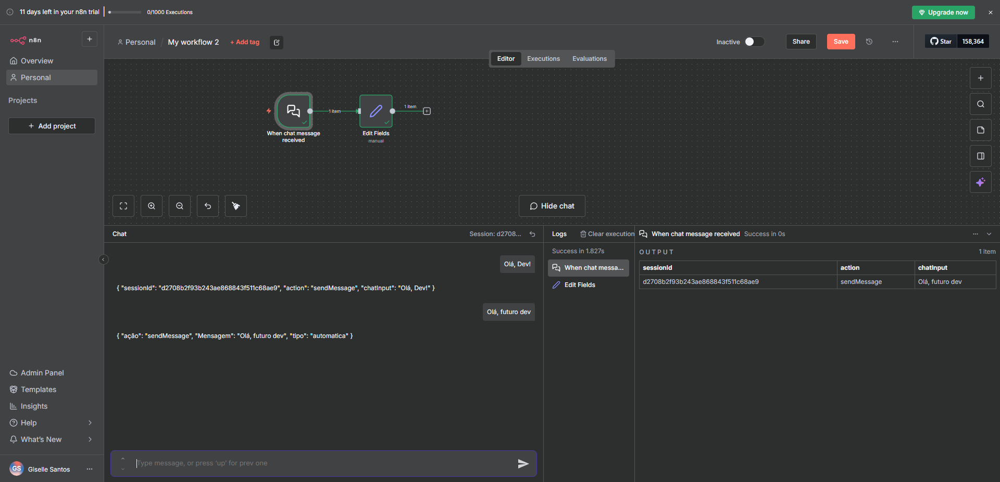
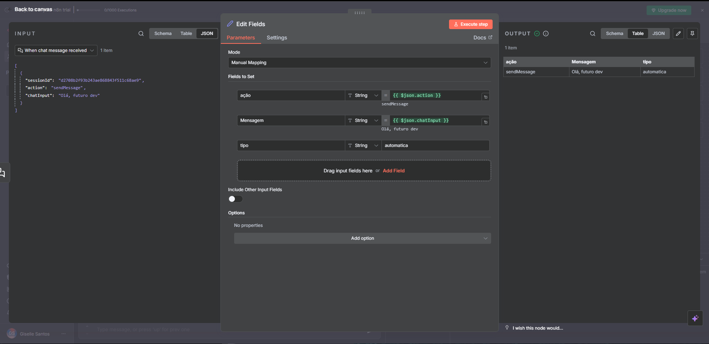
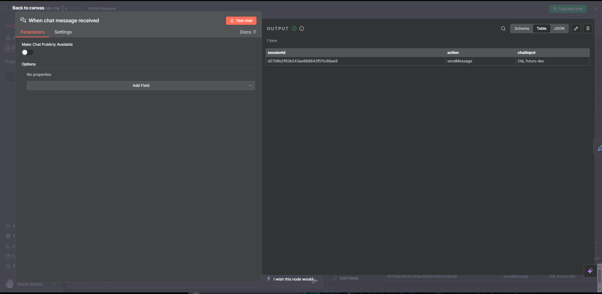
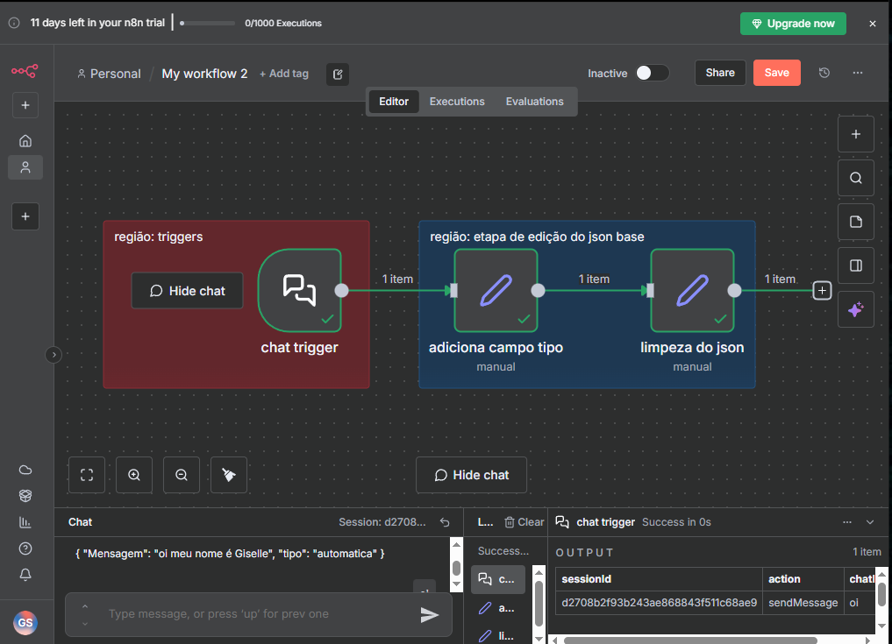

# 📚 Módulo 3: Criação de Workflows Simples no N8N

## 🎯 Sobre o Módulo

Este módulo ensina a criar workflows básicos no N8N, desde a adição de nós até a execução e documentação das automações, estabelecendo boas práticas desde o início.

---

## 📋 Conteúdo

### 1️⃣ Introdução à Criação de Workflows no N8N

Conceitos fundamentais para construção de fluxos de trabalho automatizados, estrutura básica e componentes essenciais.

### 2️⃣ Adição e Conexão de Nós em Workflows

Aprendizado sobre como adicionar nós (nodes) ao canvas e conectá-los para criar o fluxo de dados.

**Conceitos abordados:**

- O que são nós (nodes)
- Tipos de nós disponíveis
- Como adicionar nós ao workflow
- Conectar nós para criar o fluxo de dados
- Entender o fluxo de execução

**Projeto Hands-On:** Conectando Nós para Automação Eficiente

### 3️⃣ Configuração de Parâmetros dos Nós

Personalização de cada nó através da configuração de seus parâmetros específicos.

**Conceitos abordados:**

- Entender os parâmetros de cada nó
- Configurar entradas e saídas
- Usar expressões e variáveis
- Mapear dados entre nós
- Validar configurações

**Projeto Hands-On:** Personalizando Parâmetros para Fluxos Eficazes

### 4️⃣ Execução e Teste de Workflows

Práticas de execução manual e automática, além de técnicas de teste e debug.

**Conceitos abordados:**

- Executar workflows manualmente
- Entender o resultado de cada nó
- Debugar erros e problemas
- Usar o modo de teste
- Analisar logs de execução
- Otimizar performance

**Projeto Hands-On:** Testando e Otimizando Workflows para Resultados Confiáveis

### 5️⃣ Boas Práticas de Organização e Documentação

Técnicas para manter workflows organizados, legíveis e fáceis de manter.

**Boas práticas:**

- Nomear workflows de forma descritiva
- Adicionar notas e comentários
- Organizar nós visualmente
- Documentar lógica complexa
- Criar estruturas reutilizáveis
- Versionar mudanças importantes

**Projeto Hands-On:** Organizando e Documentando Workflows para Manutenção Eficiente

---

## 🎓 Resumo Visual - Aulas Práticas

### 🖼️ Canvas de Workflow



O canvas é a área principal onde você constrói seus fluxos de trabalho:

- **Adicionar nós:** Clique no botão `+` entre os nós
- **Conectar nós:** Arraste da saída de um nó para a entrada de outro
- **Organizar visualmente:** Use o mouse para posicionar os nós

### ⚙️ Configuração de Nós - Edit Fields



Ao clicar em um nó, você acessa suas configurações:

- **Parameters:** Configurações principais do nó
- **Settings:** Opções avançadas
- **Mode:** Manual Mapping, JSON, etc.
- **Fields to Set:** Campos que serão criados/modificados
- **Expressions:** Use `{{ $json.campo }}` para dados dinâmicos

**Exemplo prático:**

```javascript
// Campo "ação"
{{ $json.action }}  // Pega o valor de "action" do input

// Campo "Mensagem"  
{{ $json.chatInput }}  // Pega a mensagem do chat

// Campo "tipo"
automatica  // Valor fixo
```

### 🎯 Trigger Nodes



Nós que iniciam o workflow:

- **When chat message received:** Dispara quando recebe mensagem
- **Schedule Trigger:** Dispara em horários programados
- **Webhook:** Dispara via URL HTTP
- **Manual Trigger:** Dispara manualmente para testes

### 📊 Organização Visual com Regiões



Use sticky notes coloridas para organizar:

- **Região vermelha:** Triggers (início do workflow)
- **Região azul:** Etapa de edição/processamento
- **Região verde:** Ações finais/outputs
- Ajuda na manutenção e documentação

### 🔄 Fluxo de Dados (INPUT → OUTPUT)


Cada nó mostra:

- **INPUT (esquerda):** Dados que entram no nó
- **OUTPUT (direita):** Dados que saem após processamento
- **Abas:** Schema, Table, JSON para visualizar os dados
- **Execute step:** Botão para testar o nó individualmente

### 💬 Painel de Chat e Logs


Recursos de teste e debug:

- **Chat:** Interface para testar triggers de mensagem
- **Logs:** Histórico de execuções
- **Session ID:** Identificador único de cada execução
- **Success/Error:** Status da execução
- **Clear execution:** Limpar histórico de testes

---

## 💡 Conceitos-Chave

- **Node (Nó):** Componente individual que realiza uma ação específica
- **Connection (Conexão):** Liga entre nós que define o fluxo de dados
- **Parameters (Parâmetros):** Configurações específicas de cada nó
- **Execution (Execução):** Rodada completa do workflow
- **Expression:** Código dinâmico para manipular dados
- **Debug:** Processo de identificar e corrigir erros

---

## 🔧 Workflow Básico - Estrutura

```
[Trigger] → [Processamento] → [Ação] → [Notificação]
   ↓              ↓              ↓           ↓
 Inicia      Transforma      Executa     Informa
```

**Exemplo prático:**

```
[Schedule] → [HTTP Request] → [Set] → [Send Email]
```

---

## 📝 Checklist de Boas Práticas

### Nomenclatura

- [ ] Workflows com nomes descritivos
- [ ] Nós renomeados quando necessário
- [ ] Uso de sticky notes para documentação

### Organização Visual

- [ ] Nós alinhados e espaçados
- [ ] Fluxo da esquerda para direita
- [ ] Grupos lógicos visualmente separados

### Teste e Validação

- [ ] Testar cada nó individualmente
- [ ] Validar dados de entrada/saída
- [ ] Documentar casos de erro

### Documentação

- [ ] Adicionar notas explicativas
- [ ] Documentar variáveis importantes
- [ ] Registrar dependências externas

---

## 🔗 Links Úteis

- [Documentação de Nodes](https://docs.n8n.io/integrations/)
- [Expressions no N8N](https://docs.n8n.io/code-examples/expressions/)
- [Workflow Templates](https://n8n.io/workflows)
- [N8N Community - Exemplos](https://community.n8n.io/)

---

## ✅ Checklist de Conclusão

- [ ] Criar workflow do zero
- [ ] Adicionar e conectar múltiplos nós
- [ ] Configurar parâmetros corretamente
- [ ] Executar e testar workflows
- [ ] Implementar boas práticas de documentação
- [ ] Completar 4 projetos hands-on
- [ ] Responder 4 questionários

---

## 📌 Próximos Passos

Após este módulo você estará apto a criar workflows funcionais e bem estruturados, pronto para avançar para automações mais complexas.

---

**Programa:** Santander Coders 2025 | DIO  
**Status:** ⏳ Em Progresso
