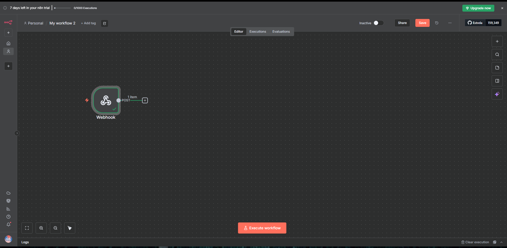
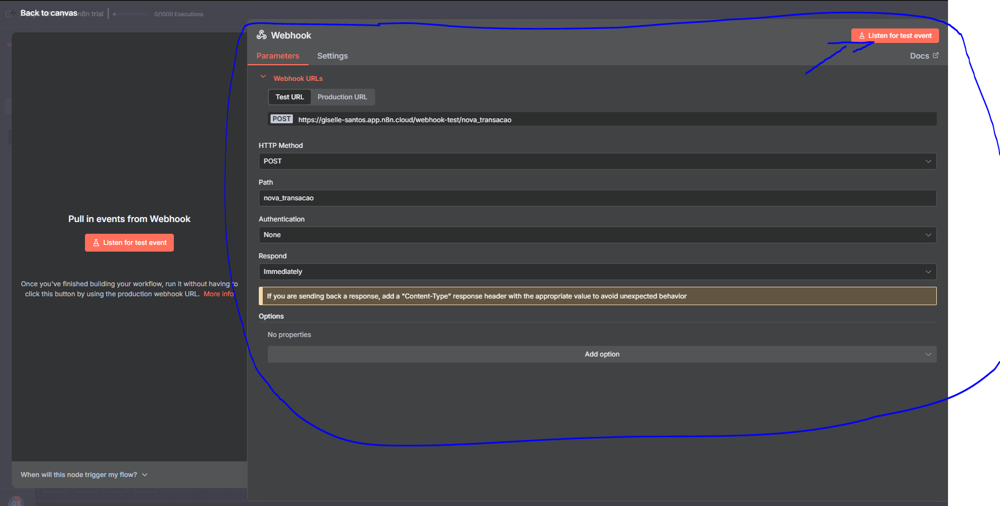
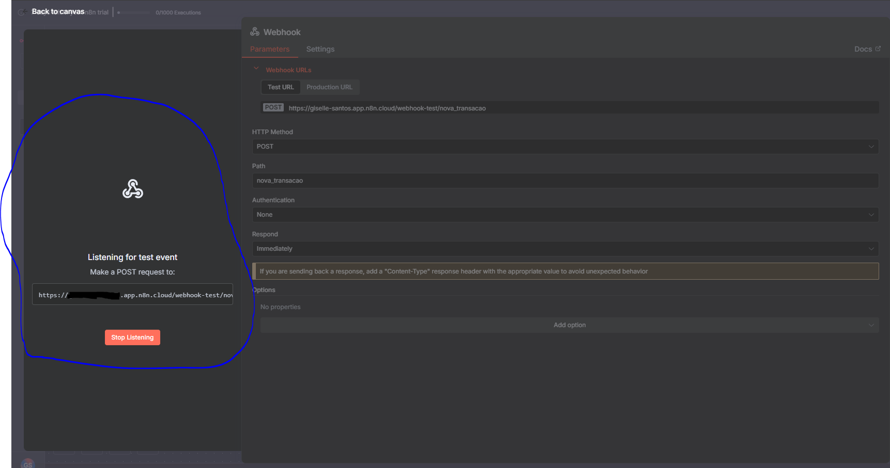
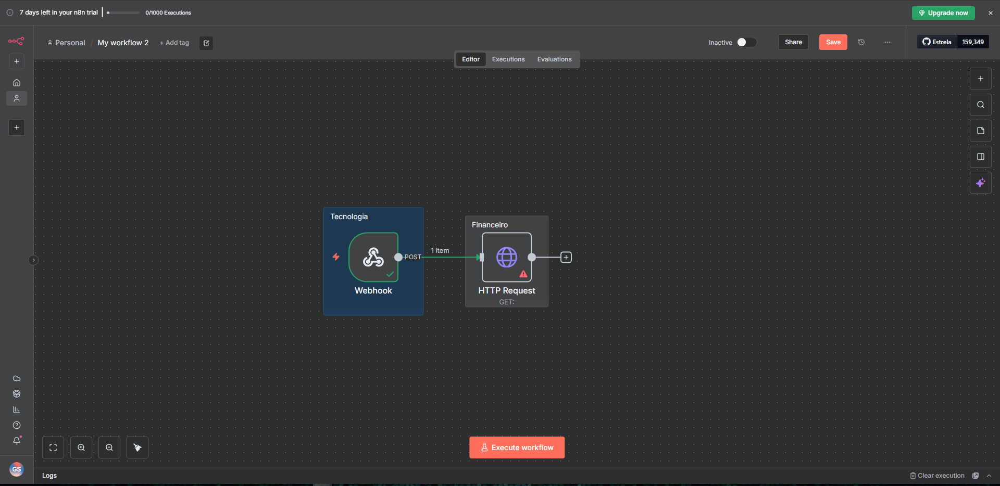
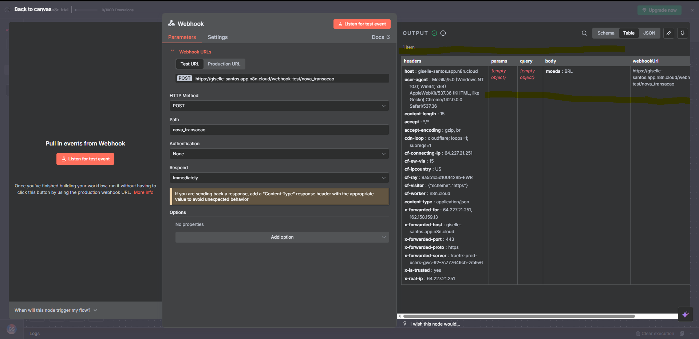
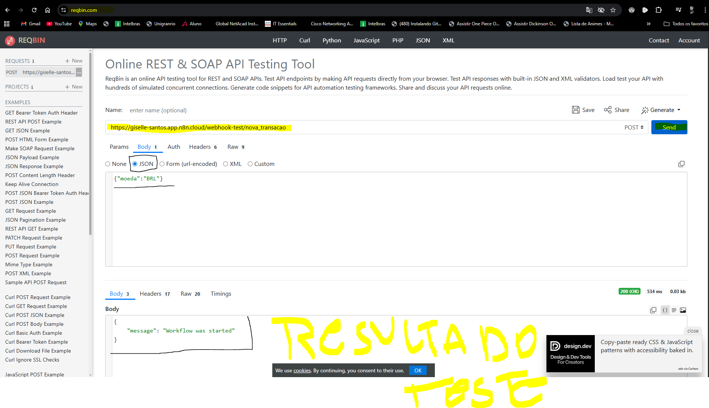
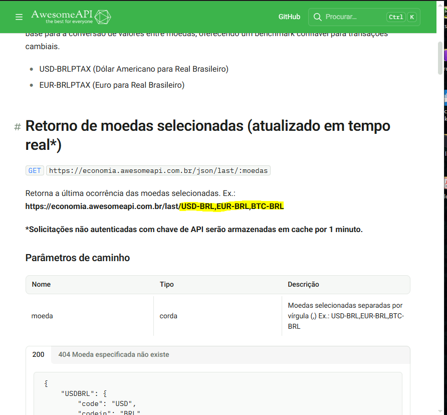
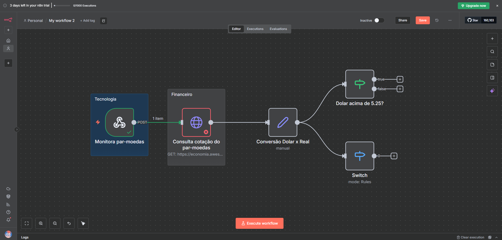
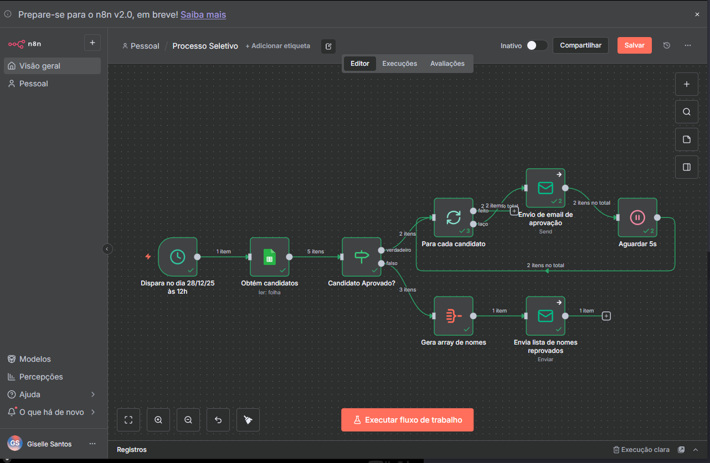

# N8N - Nós Padrão

## 📋 Resumo

Este repositório documenta o aprendizado prático sobre nós padrão no N8N, desde conceitos básicos até a implementação de automações complexas. O conteúdo abrange a arquitetura de workflows, tipos de nós disponíveis, combinações práticas e solução de problemas. Como projeto final, foi desenvolvida uma automação completa de processo seletivo, aplicando todos os conceitos estudados.

---

## Introdução ao Uso de Nós Padrão no N8N

Domínio e utilização dos nós padrão do N8N para criação de workflows automatizados. Nesta seção, aprendemos a criar um workflow básico utilizando o nó Webhook como ponto de entrada, configurando método POST e testando a execução do workflow.

**Conceitos Praticados:**

- Criação de workflow básico com nó Webhook
- Configuração de método HTTP (POST)
- Teste e execução de workflows
- Análise de output e headers recebidos

## Arquitetura Básica de um Workflow

Exploração dos tipos de nós disponíveis no N8N e como estruturar workflows de forma eficiente.

## Tipos de Nós Padrão e suas Características

Compreensão dos diferentes tipos de nós padrão disponíveis na plataforma e suas funcionalidades específicas.

## Outros Nós Padrão e suas Características

Aprofundamento em nós padrão adicionais e suas aplicações práticas em automações.

## Elaborando a Combinação de um Nó Padrão

Prática de combinação de diferentes nós padrão para criar fluxos de trabalho mais complexos e eficientes.

## Acrescentando um Nó Padrão de Serviço

Implementação de nós de serviço para integração com APIs e serviços externos.

## Solucionando Problemas em um Nó Padrão

Técnicas de debug e resolução de problemas comuns em workflows do N8N.

## Criando uma Automação de um Processo Seletivo

Desenvolvimento prático de uma automação completa para gerenciamento de processo seletivo.

## Avançando na Automação de um Processo Seletivo

Expansão e otimização da automação de processo seletivo com funcionalidades avançadas.

---

**Desenvolvido durante o curso de N8N - Nós Padrão**
