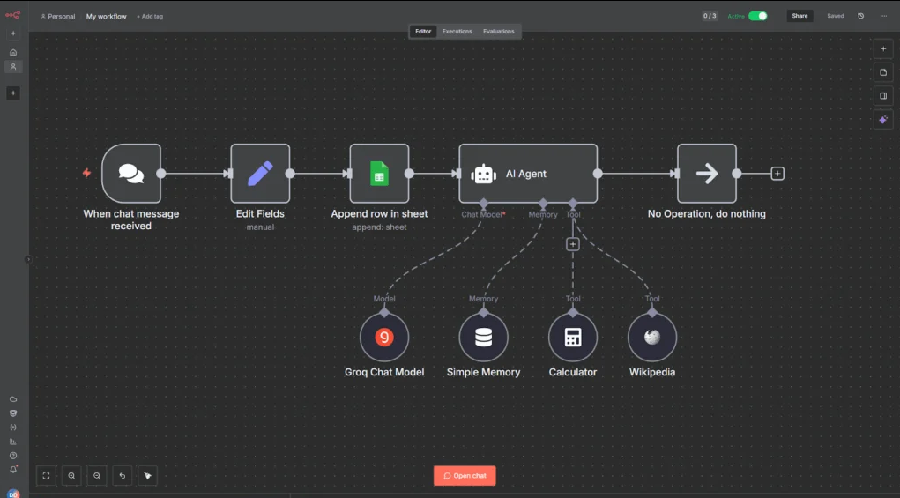

# Manipulação de Dados e Variáveis no N8N

## 📋 Índice

- [Sobre o Módulo](#sobre-o-módulo)
- [Como Funcionam as Variáveis](#como-funcionam-as-variáveis)
- [Tipos de Variáveis](#tipos-de-variáveis)
- [Expressões e Funções](#expressões-e-funções)
- [Principais Funções](#principais-funções)
- [Conversão de Dados](#conversão-de-dados)
- [IA para Gerar Expressões](#ia-para-gerar-expressões)
- [Projeto Prático](#projeto-prático-relatório-por-email)

## 🎯 Sobre o Módulo

Este módulo ensina como manipular dados e trabalhar com variáveis no N8N, incluindo o uso de expressões, funções nativas, conversão de tipos de dados e como usar IA (AI Agent) para automatizar processamento de informações.

## 📸 Exemplo Visual: Workflow com AI Agent



*Exemplo de workflow inteligente: Recebe mensagem de chat → Edita campos → Salva no Google Sheets → Processa com AI Agent (usando Groq Chat Model, Simple Memory, Calculator e Wikipedia) → Retorna resposta processada.*

Este tipo de workflow mostra como o N8N pode integrar inteligência artificial para processar dados de forma automática e inteligente.

## 🔤 Como Funcionam as Variáveis

### Conceito Básico

Variáveis no N8N são usadas para armazenar e passar informações entre diferentes etapas do workflow. Pense nelas como "caixas" que guardam dados que você quer usar depois.

### Acessando Dados

**Sintaxe básica para acessar dados:**
```
{{ $json.nomeDoCampo }}
```

**Exemplos práticos:**
- `{{ $json.nome }}` - Pega o nome do cliente
- `{{ $json.email }}` - Pega o email
- `{{ $json.endereco.cidade }}` - Pega a cidade dentro de endereço
- `{{ $json.produtos[0].nome }}` - Pega o nome do primeiro produto

### Tipos de Dados

O N8N trabalha com diversos tipos de informação:

| Tipo | Exemplo | Uso |
|------|---------|-----|
| **Texto (String)** | "João Silva" | Nomes, mensagens, descrições |
| **Número (Number)** | 42 ou 3.14 | Valores, quantidades, cálculos |
| **Verdadeiro/Falso (Boolean)** | true ou false | Ativo/inativo, sim/não |
| **Lista (Array)** | ["item1", "item2"] | Múltiplos valores |
| **Objeto (Object)** | {nome: "João"} | Dados estruturados |
| **Data (Date)** | 2026-01-23 | Datas e horários |

## 🌍 Tipos de Variáveis

### 1. Variáveis Locais (Dentro de um Node)

**O que são:**
- Existem apenas dentro de um node específico
- Servem para cálculos e processamentos temporários
- Não podem ser acessadas por outros nodes

**Quando usar:**
- Para cálculos intermediários
- Para processar dados antes de passar adiante
- Para organizar lógica dentro de um Function Node

### 2. Variáveis Globais (Todo o Workflow)

**O que são:**
- Podem ser acessadas em qualquer parte do workflow
- Ideais para configurações e constantes
- Definidas em Environment Variables

**Quando usar:**
- Chaves de API (API_KEY)
- URLs de serviços (BASE_URL)
- Configurações do sistema
- Valores que não mudam

**Como acessar:**
```
{{ $env.API_KEY }}
{{ $env.BASE_URL }}
```

### 3. Variáveis de Contexto

**O que são:**
- Guardam dados entre execuções diferentes do workflow
- Úteis para contadores e estados persistentes

**Quando usar:**
- Contador de execuções
- Último ID processado
- Estado de progresso

## 🔧 Expressões e Funções

### O que são Expressões?

Expressões permitem fazer cálculos e transformações nos dados. No N8N, elas ficam dentro de `{{ }}`.

### Operações Matemáticas

| Operação | Exemplo | Resultado |
|----------|---------|-----------|
| Soma | `{{ 10 + 5 }}` | 15 |
| Subtração | `{{ 10 - 5 }}` | 5 |
| Multiplicação | `{{ 10 * 5 }}` | 50 |
| Divisão | `{{ 10 / 5 }}` | 2 |
| Resto | `{{ 10 % 3 }}` | 1 |
| Potência | `{{ 2 ** 3 }}` | 8 |

### Comparações

| Comparação | Exemplo | Resultado |
|------------|---------|-----------|
| Maior que | `{{ 10 > 5 }}` | true |
| Menor que | `{{ 10 < 5 }}` | false |
| Igual | `{{ 10 == 10 }}` | true |
| Diferente | `{{ 10 != 5 }}` | true |

### Condições (Se/Senão)

**Sintaxe:**
```
{{ condição ? valorSeVerdadeiro : valorSeFalso }}
```

**Exemplos práticos:**

| Situação | Expressão |
|----------|-----------|
| Verificar estoque | `{{ $json.estoque > 0 ? 'Disponível' : 'Esgotado' }}` |
| Verificar idade | `{{ $json.idade >= 18 ? 'Adulto' : 'Menor' }}` |
| Calcular desconto | `{{ $json.total > 100 ? $json.total * 0.9 : $json.total }}` |

## 📚 Principais Funções

### Funções de Texto

| Função | O que faz | Exemplo |
|--------|-----------|---------|
| `toLowerCase()` | Converte para minúsculas | "JOÃO" → "joão" |
| `toUpperCase()` | Converte para maiúsculas | "joão" → "JOÃO" |
| `trim()` | Remove espaços extras | "  texto  " → "texto" |
| `replace()` | Substitui texto | "olá mundo" → "oi mundo" |
| `split()` | Divide em partes | "a,b,c" → ["a","b","c"] |
| `includes()` | Verifica se contém | Retorna true/false |
| `length` | Tamanho do texto | "João" → 4 |

### Funções de Números

| Função | O que faz | Exemplo |
|--------|-----------|---------|
| `toFixed(2)` | Fixa casas decimais | 10.5 → "10.50" |
| `Math.round()` | Arredonda | 3.7 → 4 |
| `Math.floor()` | Arredonda para baixo | 3.7 → 3 |
| `Math.ceil()` | Arredonda para cima | 3.2 → 4 |
| `Math.max()` | Maior valor | max(10, 20, 5) → 20 |
| `Math.min()` | Menor valor | min(10, 20, 5) → 5 |

### Funções de Data

| Função | O que faz | Resultado |
|--------|-----------|-----------|
| `$now` | Data/hora atual | 2026-01-23T15:30:00Z |
| `$now.format('DD/MM/YYYY')` | Formato brasileiro | 23/01/2026 |
| `$now.format('HH:mm')` | Apenas hora | 15:30 |
| `$now.plus(7, 'days')` | Adicionar dias | 7 dias no futuro |
| `$now.minus(1, 'month')` | Subtrair meses | 1 mês atrás |
| `$now.year` | Ano | 2026 |
| `$now.month` | Mês | 1 |
| `$now.day` | Dia | 23 |

### Funções de Listas (Arrays)

| Função | O que faz | Exemplo |
|--------|-----------|---------|
| `length` | Tamanho da lista | 5 itens |
| `[0]` | Primeiro item | produtos[0] |
| `includes()` | Verifica se contém | true/false |
| `join()` | Junta em texto | ["a","b"] → "a, b" |

## 🔄 Conversão de Dados

### Por que Converter?

Às vezes você recebe dados em um formato mas precisa usar em outro. Por exemplo:
- Recebe "42" (texto) mas precisa fazer conta (número)
- Tem número 10.5 mas quer mostrar "10.50" (texto)
- Tem "true" (texto) mas quer usar como verdadeiro/falso

### Conversões Comuns

| De | Para | Como Fazer | Exemplo |
|----|------|------------|---------|
| Texto | Número | `parseInt()` ou `parseFloat()` | "42" → 42 |
| Número | Texto | `toString()` ou `toFixed()` | 42 → "42" |
| Texto | Lista | `split()` | "a,b,c" → ["a","b","c"] |
| Lista | Texto | `join()` | ["a","b"] → "a, b" |
| Objeto | Texto JSON | `JSON.stringify()` | {x:1} → '{"x":1}' |
| Texto JSON | Objeto | `JSON.parse()` | '{"x":1}' → {x:1} |

### Exemplos Práticos

**Converter preço de texto para número:**
```
Recebeu: "10.50"
Converter: {{ parseFloat($json.preco) }}
Resultado: 10.5
```

**Adicionar casas decimais:**
```
Tem: 10.5
Formatar: {{ $json.valor.toFixed(2) }}
Resultado: "10.50"
```

**Separar tags:**
```
Tem: "react,node,javascript"
Separar: {{ $json.tags.split(',') }}
Resultado: ["react", "node", "javascript"]
```

## 🤖 IA para Gerar Expressões

### Como Funciona o AI Agent

O N8N pode usar inteligência artificial para processar dados de forma inteligente. O AI Agent é como ter um assistente que entende suas perguntas e consegue:

- 🤖 Processar linguagem natural
- 💾 Lembrar de conversas anteriores
- 🔢 Fazer cálculos complexos
- 📚 Buscar informações na Wikipedia
- 🔍 Analisar e interpretar dados

### Ferramentas do AI Agent

| Ferramenta | Função |
|------------|--------|
| **Groq Chat Model** | Processa texto e entende perguntas |
| **Simple Memory** | Lembra conversas anteriores |
| **Calculator** | Faz cálculos matemáticos |
| **Wikipedia** | Busca informações confiáveis |

### Exemplos de Uso da IA

**Situação 1: Precisa formatar data**

❓ **Pergunta para IA:** "Como formatar data no formato brasileiro DD/MM/YYYY no N8N?"

✅ **Resposta da IA:** Use `{{ $now.format('DD/MM/YYYY') }}`

---

**Situação 2: Calcular desconto condicional**

❓ **Pergunta para IA:** "Como calcular 15% desconto se quantidade maior que 10, senão sem desconto?"

✅ **Resposta da IA:** Use `{{ $json.qtd > 10 ? $json.preco * 0.85 : $json.preco }}`

---

**Situação 3: Validar email**

❓ **Pergunta para IA:** "Como verificar se email termina com @gmail.com?"

✅ **Resposta da IA:** Use `{{ $json.email.includes('@gmail.com') }}`

### Dicas para Usar IA

1. ✅ **Seja específico** - Quanto mais detalhes, melhor
2. ✅ **Dê exemplos** - Mostre dados de entrada e saída
3. ✅ **Mencione N8N** - Deixe claro que é para N8N
4. ✅ **Teste sempre** - Valide a resposta antes de usar

## 📧 Projeto Prático: Relatório por Email

### Objetivo do Projeto

Criar um sistema que automaticamente:
1. Busca vendas do dia no Google Sheets
2. Calcula totais e estatísticas
3. Gera ranking de vendedores
4. Envia relatório bonito por email

### Estrutura do Workflow

```
⏰ Schedule (Todo dia 8h)
   ↓
📊 Google Sheets (Buscar vendas)
   ↓
⚙️ Function (Calcular totais)
   ↓
📝 Set (Preparar email)
   ↓
📧 Send Email (Enviar relatório)
```

### O que o Sistema Faz

**Etapa 1: Buscar Vendas**
- Conecta no Google Sheets
- Busca todas as vendas do dia atual
- Filtra apenas dados válidos

**Etapa 2: Calcular Estatísticas**
- Total de vendas do dia
- Valor total faturado
- Ticket médio (valor médio por venda)
- Comissão total (10% do faturamento)
- Ranking dos melhores vendedores

**Etapa 3: Gerar Relatório**
- Cria email em HTML bonito e profissional
- Adiciona gráficos de resumo
- Destaca top 3 vendedores com medalhas 🥇🥈🥉
- Inclui tabela detalhada de todas as vendas

**Etapa 4: Enviar Email**
- Envia para gerência
- Com formatação profissional
- Layout responsivo (funciona em celular)

### Informações no Relatório

**Caixas de Resumo:**
- 📊 Total de Vendas
- 💰 Faturamento do Dia
- 🎯 Ticket Médio
- 💵 Comissão Total

**Ranking de Vendedores:**
- 🥇 1º Lugar - Nome e valor vendido
- 🥈 2º Lugar - Nome e valor vendido
- 🥉 3º Lugar - Nome e valor vendido

**Tabela Completa:**
- Horário de cada venda
- Nome do cliente
- Vendedor responsável
- Produto vendido
- Valor da venda

### Benefícios do Sistema

✅ **Automático** - Roda todo dia sem intervenção
✅ **Pontual** - Sempre no mesmo horário (8h)
✅ **Completo** - Todas as informações importantes
✅ **Visual** - Fácil de ler e entender
✅ **Profissional** - Layout bonito e organizado

## 💡 Casos de Uso Práticos

### 1. Validação de Cadastro

**Objetivo:** Verificar se dados do cliente estão corretos antes de salvar

**Validações necessárias:**
- ✅ Nome tem pelo menos 3 caracteres
- ✅ Email está em formato válido (tem @ e .)
- ✅ CPF tem 11 dígitos
- ✅ Idade está entre 18 e 120
- ✅ Telefone tem pelo menos 10 dígitos

**Resultado:**
- Se tudo OK → Salva no banco de dados
- Se tem erro → Retorna lista de problemas

---

### 2. Geração de Código Único

**Objetivo:** Criar código de pedido automaticamente

**Formato do código:**
```
PED260123-1234
```

**Onde:**
- PED = Prefixo "Pedido"
- 26 = Ano (2026)
- 01 = Mês (Janeiro)
- 23 = Dia
- 1234 = Número aleatório único

**Uso:** Cada pedido novo recebe um código único e rastreável

---

### 3. Cálculo de Frete

**Objetivo:** Calcular valor do frete baseado em regras

**Regras:**
- 🚚 Até 1kg → R$ 10
- 🚚 1kg a 5kg → R$ 20
- 🚚 5kg a 10kg → R$ 35
- 🚚 Acima de 10kg → R$ 50
- 🎁 Grátis se compra > R$ 200

**Resultado:** Valor correto do frete calculado automaticamente

---

### 4. Normalização de Telefone

**Objetivo:** Padronizar diferentes formatos de telefone

**Entrada pode ser:**
- (11) 99999-9999
- 11999999999
- +55 11 99999-9999
- 11 9 9999-9999

**Saída padronizada:**
```
5511999999999
```

**Benefício:** Todos os telefones no mesmo formato no banco de dados

## 📚 Recursos Adicionais

### Documentação Oficial
- [N8N Expressions](https://docs.n8n.io/code-examples/expressions/) - Guia de expressões
- [N8N Functions](https://docs.n8n.io/code-examples/methods-variables-examples/) - Lista de funções
- [N8N Community](https://community.n8n.io/) - Fórum da comunidade

### Aprendizado
- [N8N Academy](https://academy.n8n.io/) - Cursos gratuitos
- [Canal YouTube N8N](https://www.youtube.com/@n8n-io) - Tutoriais em vídeo
- [Blog N8N](https://blog.n8n.io/) - Artigos e dicas

### Dicas Finais

1. **Teste sempre** - Execute manualmente antes de ativar
2. **Comece simples** - Adicione complexidade aos poucos
3. **Use IA** - Quando não souber uma expressão, pergunte ao AI Agent
4. **Documente** - Adicione notas explicando o que cada parte faz
5. **Monitore** - Verifique logs de execução regularmente

---

**Desenvolvido com ❤️ para facilitar a manipulação de dados no N8N!**